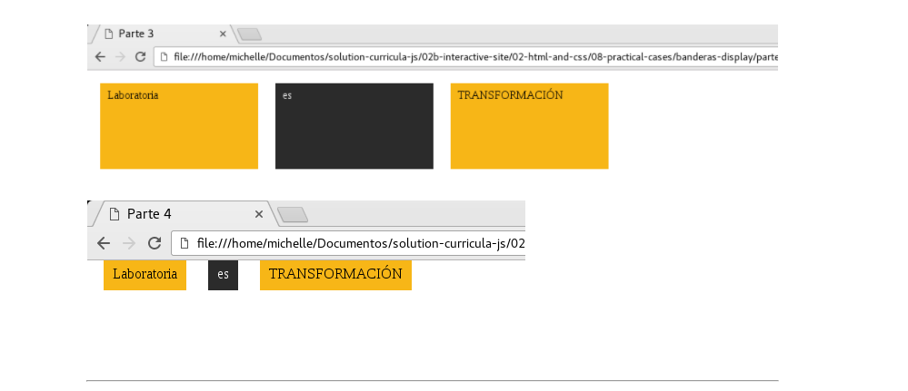
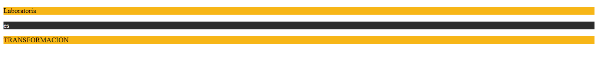
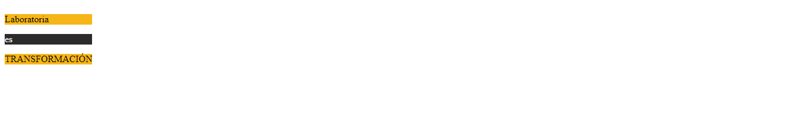
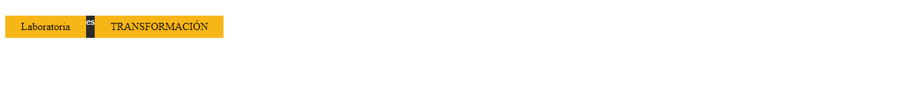
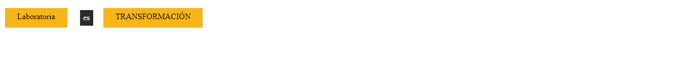

### Banderas Display ###
*************************************************************
1. **Descripción**

 * Este proyecto trata sobre la propiedad display en la que se busca acomodar las banderas de forma que quede de la siguiente manera:
 

2. **Desarrollo**

 * Para Desarrrollar este proyecto vamos ha seccionarlo en cuatro partes:

  a) _parte 1_

   Colocamos el contenido en tres párrafos, luego lo seleccionamos en tres partes como hay dos que poseen color amarillo le ponemos el mismo nombre de clase y al otro,otro nombre de clase.Esto netamente es para ponerle color a los párrafos,tenemos lo siguiente:
   

  b) _parte2_

   Para esta parte  aplicamos display inline-block para que quede de la siguiente forma:
   

  c) _Parte 3_

  Para la tercera parte utilizé display flex me permitió posisionarlo de la siguiente forma:

  d)_parte 4_

  Para esta última parte utilizé margin para separar los elementos y acomodarlos de fornma que quede similar a lo pedido, porlo que finalmente nos queda así:
